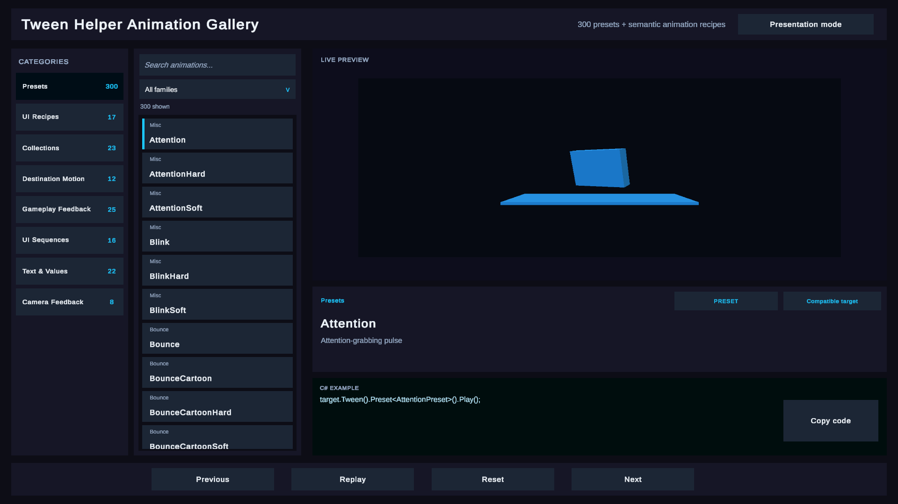

# From installation to your first animation

This written walkthrough accompanies 1.3.0-rc.1. It uses existing objects and actual Gallery screenshots; it is not a recording of Editor interactions.

1. Install DOTween Free separately. Open **Tools > Demigiant > DOTween Utility Panel**, run **Setup DOTween**, and enable UI support.
2. Import Tween Helper using **Assets > Import Package > Custom Package**. Import **TMP Essential Resources** for Gallery text.
3. Open **Tools > Tween Helper > Setup & Support**, then run **Tools > Tween Helper > Validate > DOTween Setup**. No settings asset is required.
4. Open TweenHelperAnimationGallery under Assets/Loags/TweenHelper/Samples/TweenHelper Demos/Scenes and enter Play Mode. Select a category and animation; use Replay/Reset and copy the displayed call.



5. Stop Play Mode, return to your scene and attach this script to an existing card or object. Enter Play Mode: it scales into view. Disable it to release its owned animation.

```csharp
using LB.TweenHelper;
using UnityEngine;

public sealed class AnimatedCard : MonoBehaviour
{
    private TweenHandle _entrance;

    private void OnEnable()
    {
        _entrance = gameObject.Tween().Preset<PopInPreset>(0.35f).Play();
    }

    private void OnDisable()
    {
        _entrance?.Kill();
        _entrance = null;
    }
}
```

6. Open **Tools > Tween Helper > Preset Browser**. Filter by use case, save a favorite, and copy its call. Tab to the list and use native arrow-key selection. Reset filters if no entries match.
7. Assign the shipped PanelMoveFade recipe to a TweenPlayer on an existing object. Choose **Sync Bindings**, assign targets, validate and preview. Fade targets need a supported visual component such as CanvasGroup. Wire a Button On Click to **TweenPlayer > PlayFromEvent()**.
8. Place ProgressRewardDemo.prefab under an existing Canvas with an EventSystem. Its filled Image, reward binding and motion Toggle are authored and wired. Change the toggle, then replay through the TweenPlayer Inspector; preferences apply to newly built playback.

Continue with the package QuickStart, LifecycleAndMigration, MotionPreferences and RecipeWorkflows guides for cancellation, pooling and supported motion families. DOTween is separately installed; Tween Helper preserves host-engine settings unless you opt in.