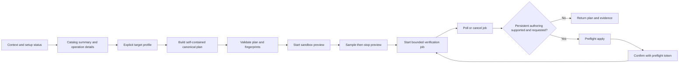

# TweenHelper Unity Pipeline CLI Roadmap

- Status: Reviewed implementation roadmap and agent handoff document
- Last reviewed: 2026-08-12
- Scope: Unity Pipeline CLI commands, UCodex workflows, TweenHelper planning, sandbox preview, verification, and gated authoring

This document is the implementation plan for exposing TweenHelper through Unity's local Pipeline command surface. It deliberately separates repository-only developer commands from generic commands that may eventually ship for TweenHelper users.

## Review verdict and binding decisions

The integration idea is viable, and the developer-first approach is correct. Implementation must follow these reviewed decisions:

1. **Keep the base artifact Pipeline-free.** Installed `com.unity.pipeline` `0.3.1-exp.1` declares Unity `6000.0` as its minimum, while TweenHelper supports Unity `2022.3+`. The public Pipeline adapter must therefore not be placed inside the current `Assets/Loags/TweenHelper` export root.
2. **Prototype in repository-only tooling.** Prove command discovery, schemas, threading, and safety under `Assets/_Project/TweenHelperDevelopment/CLI` before creating any customer artifact.
3. **Separate domain services from transport DTOs.** Catalog, profiling, planning, validation, and execution logic must not depend on `Unity.Pipeline`. Pipeline DTOs and attributes belong only in an adapter assembly.
4. **Use Pipeline's transport envelope.** Do not wrap results in a second duplicate `command`/`ok` envelope. Return a versioned TweenHelper result body inside Pipeline's existing `success`, `command`, `result`, `error`, and timing envelope.
5. **Pass self-contained plans.** A plan returned by `tween_helper_plan` must be passed to validation, preview, verification, and authoring. A hash without the canonical plan is not an executable contract, and an in-memory plan registry would not survive reloads.
6. **Sandbox preview and verification.** Public v1 must animate only owned, isolated preview objects. It must not tween the user's live scene or prefab target; current UI helpers can add serialized cache components, and ordinary Transform changes can dirty a scene even when values are restored.
7. **Start with a preset MVP.** Registered built-in presets on one explicit target are the first executable plan slice. Fluent graphs, collections, destination motion, feedback, and production UI sequences are added only after each family has descriptors, a mutation footprint, and a verification oracle.
8. **Keep persistence gated.** `tween_helper_apply_plan` remains unavailable until TweenHelper has a stable serialized recipe/component representation, an enforceable preflight token, idempotency behavior, and a rollback story.

The likely public distribution is a separate Unity-6-compatible companion. UPM is technically preferable because it can declare package dependencies and can support multiple packages per product, but it requires the publisher's UPM enrollment and product decision. A second `.unitypackage` remains only a compatibility-tested fallback with manually disclosed dependencies. Neither option is a release commitment while Pipeline is experimental.

## Current project baseline

- Product root: `Assets/Loags/TweenHelper`.
- Repository-only tooling: `Assets/_Project/TweenHelperDevelopment`.
- Base distribution: standard Asset Store `.unitypackage`, not a UPM package.
- Runtime namespace: `LB.TweenHelper`.
- Existing Editor namespace: `LB.TweenHelper.Editor`.
- Proposed CLI namespace: `LB.TweenHelper.Pipeline.Editor`.
- Base minimum: Unity `2022.3.0f1` and the documented DOTween dependency.
- Local development Editor: Unity `6000.5.2f1`.
- Local Pipeline package: `com.unity.pipeline` `0.3.1-exp.1`.
- Pipeline package minimum: Unity `6000.0`, as declared by its installed `package.json`.
- Built-in preset invariant: exactly 300 constructible, registered presets.
- Existing relevant validation:
  - `AnimationResetAuditRunner` for repeat-play, reset, stress, and batch reset checks.
  - `PresetValidationTools` for DOTween setup, registry integrity, and catalog checks.
  - EditMode and PlayMode lifecycle tests under `Assets/_Project/TweenHelperDevelopment/Tests`.
- Existing public animation families include presets, fluent builder sequences, staggered collections, destination motion, gameplay feedback, and production UI sequences.
- Existing `PresetBrowserPreview` is an isolated synthetic preview stage. It is a useful safety pattern, but it is not a target-specific live-object preview service.
- `PresetValidationTools` currently exposes menu/logging entry points rather than structured result services, and `AnimationResetAuditRunner` is a scene `MonoBehaviour`. Both need thin structured facades or small refactors before a CLI adapter can consume their evidence reliably.
- `TweenPresetRegistry.Refresh()` mutates global registry state and scans every loaded assembly that references TweenHelper. It must not be used as the implementation of a read-only built-in catalog command.
- `DOTweenSetupValidator` currently contains two version notions (`MinimumPackageVersion` and `MinimumRuntimeVersion`) that do not match the release roadmap wording. Setup status must use one shared compatibility policy before its CLI contract is frozen.

No project-owned Pipeline CLI command implementation exists yet. This is a reviewed plan, not evidence that TweenHelper commands have been registered or executed.

Review-time Editor evidence on 2026-08-12:

- Unity MCP reported the Editor ready, stopped, not compiling, and not reloading.
- The open validation scene was clean.
- `com.unity.pipeline` `0.3.1-exp.1` was installed as a direct dependency.
- No captured Console errors were present.

That evidence is time-scoped and must not be copied forward as proof for a later implementation or release. Future agents must capture fresh Editor evidence. No batch build was requested or run for this documentation review.

## Product boundaries

| Layer | Location | Audience | Pipeline dependency | May ship? |
| --- | --- | --- | --- | --- |
| Runtime | `Assets/Loags/TweenHelper/Runtime` | Every TweenHelper user | None | Yes |
| Existing public Editor tools | `Assets/Loags/TweenHelper/Editor` | Every TweenHelper user | None or existing optional dependencies | Yes |
| Pipeline-neutral automation core | Future `Assets/Loags/TweenHelper/Editor/Automation` if it also benefits public Editor tooling | Every TweenHelper user | None | Yes, after API review |
| Public Pipeline adapter | Separate companion root or UPM package, never the current base export root | Unity 6 users who install Pipeline | Required by companion, Editor-only | Yes, after compatibility and publishing proof |
| Developer Pipeline adapter | `Assets/_Project/TweenHelperDevelopment/CLI` | Maintainers and agents | Pipeline plus test/validation tooling | No |
| Validation assets and tests | `Assets/_Project/TweenHelperDevelopment` | Maintainers and CI-like local runs | Development-only | No |

The public adapter must not reference development scenes, test assemblies, `AnimationResetAuditRunner`, private project callbacks, or project-specific folder assumptions. The developer adapter may call those systems, but it must not accidentally register project-only presets in the public catalog.

The Pipeline-neutral core must use ordinary domain models. It must not implement `IStructuredCommandInput`, reference `ObjectRef`, or depend on Pipeline/Newtonsoft transport details. The public and developer adapters map their wire DTOs to this core.

## Desired UCodex workflow

The commands should let an agent move from context to a verified animation without guessing about the target, the catalog, or lifecycle behavior.



The normal agent sequence is:

1. Ask for `context` and `setup_status` before making assumptions about Unity, TweenHelper, DOTween, UI modules, scenes, or selection. If the optional adapter is absent, no TweenHelper Pipeline command can report that absence; installation documentation and the existing non-Pipeline Editor setup UI own that case.
2. Query the paginated `catalog`, request full details only for candidate operations, and profile an explicit target.
3. Produce a normalized, self-contained `plan`; do not mutate assets or store an invisible server-side plan while choosing an animation.
4. Run `validate_plan` and resolve every error before previewing. Validation returns target/configuration fingerprints that downstream commands recalculate.
5. Start an isolated preview session, sample it deterministically where the operation supports that, and explicitly stop it. The server watchdog also expires abandoned sessions.
6. Start a bounded verification job, poll it with `job_status`, and use `job_cancel` if needed.
7. Only after a public authoring representation exists, call `apply_plan` in dry-run mode to receive a short-lived preflight token, then call it again with that token and `confirm: true`.
8. Verify the persisted representation again and return the canonical plan plus evidence.

## Proposed public command catalog

Names below are proposed stable IDs. Use lower snake case unless the Pipeline package's command naming convention requires a documented equivalent. Do not expose a second alias set before the first set is stable.

| Command | Initial maturity | Side effects | Purpose |
| --- | --- | --- | --- |
| `tween_helper_context` | Developer prototype, public v1 | Read-only | Report sanitized Unity/TweenHelper/DOTween versions, active scene state, selection summary, adapter version, and supported capability flags. |
| `tween_helper_setup_status` | Developer prototype, public v1 | Read-only | Check DOTween runtime/module availability, UI prerequisites, settings status, and the installed adapter/Pipeline compatibility pair. It never installs or changes packages. |
| `tween_helper_catalog` | Developer prototype, public v1 | Read-only | Return a deterministic, filtered, paginated catalog summary plus scope-specific catalog hash. Built-ins are the default scope. |
| `tween_helper_describe_operation` | Developer prototype, public v1 | Read-only | Return one operation's complete parameter schema, defaults, compatibility requirements, mutation footprint, determinism class, and verification support. |
| `tween_helper_target_profile` | Developer prototype, public v1 | Read-only | Inspect one explicit structured object reference and report canonical identity, supported components, UI/world classification, relevant current values, and compatible operation IDs. |
| `tween_helper_plan` | Developer prototype, public v1 preset MVP | Read-only | Convert a normalized request into a self-contained canonical plan with resolved defaults, fingerprints, warnings, and SHA-256 plan hash. |
| `tween_helper_validate_plan` | Developer prototype, public v1 preset MVP | Read-only | Recalculate hashes/fingerprints and validate references, capabilities, parameters, timing, loops, lifecycle policy, and requested execution mode. |
| `tween_helper_preview_start` | Developer prototype, public v1 preset MVP | Creates owned hidden objects and temporary tween state | Create an isolated preview session from a validated plan and return its session ID, expiry, and supported sample points. |
| `tween_helper_preview_sample` | Developer prototype, public v1 preset MVP | Mutates only an owned preview sandbox | Move an existing preview to a normalized time or named phase and return observed state and optional capture metadata. |
| `tween_helper_preview_stop` | Developer prototype, public v1 preset MVP | Destroys owned temporary state | Kill only session-owned tweens, dispose the sandbox, and report cleanup evidence. Idempotent for an already-stopped session. |
| `tween_helper_verify_start` | Developer prototype, public v1 preset MVP | Creates owned temporary state and an asynchronous job | Start a bounded manual-clock verification job and return a job ID. Public v1 does not enter Play Mode. |
| `tween_helper_job_status` | Developer prototype, public v1 | Read-only snapshot | Poll an asynchronous public job by opaque job ID without touching Unity objects from a background thread. |
| `tween_helper_job_cancel` | Developer prototype, public v1 | Stops owned temporary work | Request cancellation and main-thread cleanup of an owned job. Idempotent after completion. |
| `tween_helper_apply_plan` | Gated / public v2 | Writes supported project state | Persist only an approved serialized TweenHelper representation. Requires a successful dry-run preflight, a matching short-lived token, stable fingerprints, idempotency key, and explicit confirmation. |

### Public command rules

- `context`, `setup_status`, `catalog`, `target_profile`, `plan`, and `validate_plan` must be safe to call repeatedly.
- `catalog` must default to a bounded summary page. Require explicit filters/cursors for more entries; never return all detailed descriptors for 300 presets by default.
- `describe_operation` is the detail endpoint. Catalog summaries and operation descriptions must use stable IDs rather than arbitrary C# type names.
- `target_profile` must not silently fall back from an invalid explicit target to the Editor selection.
- Preview lifecycle actions remain separate commands so each reflected schema is unambiguous and cleanup can be retried independently.
- Public v1 preview and verification operate only on command-owned hidden objects. A live-target preview is a separately gated future feature, not an implementation shortcut.
- Preview sessions and jobs require opaque server-generated IDs, owner/type metadata, TTLs, conflict rules, bounded retained results, and cleanup hooks for assembly reload and Play Mode transitions. Connection loss is handled by TTL/watchdog cleanup; Unity process crashes cannot offer a restoration guarantee.
- Verification must have bounded duration and a clear cleanup path. Infinite-loop plans are valid only when the scenario supplies a kill condition and a shorter hard timeout.
- `job_status` may use `MainThreadRequired = false` only if it reads an immutable/thread-safe snapshot. It must never dereference a Unity object off the main thread.
- `apply_plan` is not part of the first public implementation unless there is a stable persisted authoring representation. Until then, the public surface should return a plan, preview it, verify it, and optionally emit a copyable API example without writing arbitrary source files.
- `setup_status` must follow the existing product rule: diagnose and explain; never automatically add, remove, update, or configure unrelated packages.
- Command aliases and shorthand IDs are out of scope until the canonical IDs have shipped and compatibility policy exists.

## Proposed developer-only command catalog

These commands are intentionally namespaced with `dev` and must remain under repository-only development tooling. They are for fast agent loops and maintainer validation, not for customer projects.

| Command | Side effects | Purpose and existing system |
| --- | --- | --- |
| `tween_helper_dev_prepare_fixture` | Creates or updates explicitly approved validation fixtures | Prepare a known target, scene, prefab, or validation setup. Requires `dry_run`/`confirm` and an allowlisted development path. |
| `tween_helper_dev_validate_catalog` | Read-only by default; optional report under `Temp` | Run registry integrity, built-in count, descriptor coverage, catalog drift, and documentation checks through a structured service extracted from `PresetValidationTools`. |
| `tween_helper_dev_run_reset_audit` | Explicit Play Mode transition, validation animation, and optional reports under `Temp` | Drive an explicitly referenced `AnimationResetAuditRunner`/fixture through a job facade and return structured pass/fail counts. Never locate the runner through a hierarchy-name search. |
| `tween_helper_dev_run_tests` | Conditional wrapper; test execution and artifacts | Add only if a TweenHelper suite alias/report normalization materially improves the built-in Pipeline `run_tests`, `test_status`, and `cancel_tests` commands. Otherwise use the built-ins directly. |
| `tween_helper_dev_collect_diagnostics` | Read-only, optional report output | Collect Editor state, package versions, assemblies, console logs, catalog hash, plan hash, and validation summaries without external upload. |
| `tween_helper_dev_cleanup_sessions` | Restores temporary state | Dispose abandoned preview/verification sessions and report anything that could not be restored. |

Developer commands may call existing validation code, but should not duplicate its logic. They should be thin Pipeline adapters over testable application services.

Developer jobs must be distinguishable from public jobs. Either use separate `tween_helper_dev_job_status`/`tween_helper_dev_job_cancel` commands or enforce an audience field in opaque job records so a public adapter cannot enumerate or control repository-only jobs.

## Shared request and response contract

Each command should take one command-specific `input` DTO implementing Pipeline's `IStructuredCommandInput`. This keeps generated MCP/CLI schemas evolvable and avoids long unrelated parameter lists. Domain services receive mapped ordinary C# models rather than Pipeline DTOs.

The installed Pipeline version imposes important schema limits:

- Only a concrete type implementing `IStructuredCommandInput` is emitted as a nested object schema.
- `Unity.Pipeline.Models.ObjectRef` does not implement that marker in `0.3.1-exp.1`, so it is advertised as a string even though its JSON converter accepts several forms. Define a TweenHelper `ObjectReferenceInput` structured DTO and map it to `ObjectRef` after validation.
- Unity structs such as `Vector3` and `Color` also fall back to string schemas. Use structured numeric DTOs or fixed-length numeric arrays with explicit validation.
- The generator does not express polymorphic/discriminated unions. Use a `kind` plus concrete optional sub-objects, validate that exactly one matching sub-object is supplied, and keep the preset MVP schema small.
- Top-level command and argument IDs use `lower_snake_case`; members inside structured JSON use `lowerCamelCase` through `[CliArg]` names.

Example Pipeline request shape:

```json
{
  "command": "tween_helper_validate_plan",
  "parameters": {
    "input": {
      "schemaVersion": 1,
      "requestId": "caller-generated-id",
      "plan": { "planSchemaVersion": 1 }
    }
  },
  "timeout": 15000
}
```

`timeout` above is Pipeline's HTTP command timeout in milliseconds. A preview/job's `timeoutSeconds` is a separate domain field and must not be conflated with it.

### Result layering

Pipeline already returns a transport envelope containing `success`, `command`, `result`, `executionTimeMs`, `executedAt`, `error`, and `errorDetails`. TweenHelper returns this versioned body inside `result`:

```json
{
  "success": true,
  "command": "tween_helper_validate_plan",
  "result": {
    "schemaVersion": 1,
    "requestId": "caller-generated-id",
    "status": "valid",
    "warnings": [],
    "errors": [],
    "data": {
      "planHash": "sha256:...",
      "catalogHash": "sha256:...",
      "targetProfileHash": "sha256:...",
      "resolvedDuration": 0.45,
      "requiredCapabilities": ["RectTransform", "CanvasGroup"]
    }
  },
  "executionTimeMs": 4
}
```

Transport failure and domain failure are different:

- Malformed JSON, an unbindable required input, or an unexpected exception uses Pipeline's failed transport envelope.
- Expected outcomes such as an incompatible target, invalid plan, stale fingerprint, refused write, or verification failure return `success: true` at the transport layer with a TweenHelper `status` such as `invalid`, `rejected`, `failed`, `cancelled`, or `timed_out` and typed issues in `result.errors`.

Issue entries contain at least `code`, `message`, and optional `fieldPath`/safe details. Initial codes include `missing_dependency`, `unsupported_schema`, `invalid_object_reference`, `invalid_target`, `incompatible_operation`, `unsupported_operation`, `catalog_scope_not_allowed`, `stale_catalog`, `stale_target`, `stale_configuration`, `unsafe_write`, `preflight_required`, `preflight_expired`, `preview_conflict`, `preview_cleanup_failed`, `job_not_found`, and `verification_timeout`.

### Common contract rules

- `schemaVersion` is required on every structured input and TweenHelper result body. Additive fields may evolve within a version; breaking input or semantic changes require a new version and an explicit support window.
- `requestId` is optional for pure reads but required for session/job creation and writes. Enforce length/character limits. A retry with the same ID and identical canonical input returns the existing result; reuse with different input is rejected.
- Object-reference input must contain exactly one primary address form. Read-only calls may accept `globalId`, asset `path`, `guid` plus optional `fileId`, `instanceId`, or explicitly requested selection. Preview/verification sessions may use an `instanceId` within the current domain. Persistent writes require a stable `globalId` or asset `guid`/`fileId`; hierarchy paths and implicit selection are rejected.
- `dryRun` wins over `confirm`. A dry run must not mutate anything.
- A confirmed write requires `confirm: true`, a required idempotency/request ID, explicit stable target/path, matching plan/catalog/configuration/target fingerprints, and a short-lived server-issued preflight token returned by a prior `apply_plan` dry run. Flags alone do not prove that the caller reviewed the current preflight.
- Paths must be project-relative, normalized, and confined to an allowlisted root. TweenHelper's adapter intentionally rejects absolute paths even though Pipeline's general `ProjectPaths.Resolve` can normalize some project-contained absolute paths. Reject traversal, `Library`, `Temp` as an authoring destination, package-cache paths, and unrelated project roots.
- Results expose project-relative paths and canonical Unity identities by default. Do not include machine identifiers, absolute user paths, project names, authentication data, unrelated source content, or Pipeline descriptor/token data.
- Include `toolVersion`, hashes, `jobId`, `previewSessionId`, expiry, and cleanup status only when relevant.
- Domain result data should be deterministic; the outer Pipeline envelope necessarily contains execution time and timestamp metadata.
- Mutation results may include Pipeline `AuthoringResult` identities nested in `changedObjects`, but `AuthoringResult` does not replace the TweenHelper result body because it has no warnings, status, or contract version.

## Normalized animation plan

The plan is the central boundary between UCodex intent and TweenHelper execution. It must be deterministic, inspectable, self-contained, transport-neutral, and safe to replay after a command round trip.

### Schema shape and scope

Plan schema v1 starts with one or more explicitly identified targets and an ordered list of built-in preset steps. The first executable slice is one target and one built-in preset; arrays and ordering exist in the model only when their semantics and schemas are tested. A conceptual plan contains:

- `planSchemaVersion`, `toolSemanticsVersion`, `catalogScope`, `catalogHash`, and `configurationHash`;
- a target table with plan-local target IDs, canonical structured references, and target-profile hashes;
- ordered step IDs with a `kind`, stable operation ID, target IDs, a matching concrete operation payload, timing relationship, and typed option payload;
- lifecycle policy for completion, cancellation, external kill, hard timeout, destroyed sandbox target, rewind, and restore;
- execution policy such as `sandbox_preview`, `sandbox_verify`, or a future supported authoring mode;
- resolved defaults and warnings so an agent can explain the generated behavior;
- determinism metadata and an optional local seed only for operation families that actually support seeded execution.

Later additive operation slices are introduced in this order unless evidence justifies a change:

1. finite built-in presets;
2. infinite-loop built-in presets with explicit kill scenarios;
3. allowlisted fluent builder steps and append/join/interval ordering;
4. deterministic staggered collections with explicit ordered target lists and owner reference;
5. destination motion with explicit local/world/anchored space and typed control points;
6. feedback and production UI sequences with documented baseline/cache semantics;
7. explicitly opted-in project extensions.

Operation IDs are opaque catalog IDs, not caller-supplied type or method names. The adapter resolves only allowlisted descriptors; it must not invoke an arbitrary reflected method.

### Hashes and staleness

- Use SHA-256 with a `sha256:` prefix for plan, catalog, configuration, and target-profile hashes.
- Define a schema-specific canonical UTF-8 JSON writer: ordinal property ordering, preserved array order, invariant numeric formatting, normalized enums/identifiers, rejected NaN/infinity, and explicit rules for null/default omission. Do not rely on default Newtonsoft property order or current culture.
- `planHash` covers canonical plan content but excludes `planHash` itself, request IDs, timestamps, job/session IDs, preflight tokens, and observation results.
- `catalogHash` covers the selected scope and execution-relevant descriptor fields. Documentation text and pagination do not invalidate a plan.
- `configurationHash` covers only settings that affect execution semantics.
- `targetProfileHash` covers canonical identity, required components, and serialized values in the operation's declared mutation/baseline footprint. It must not hash unrelated project state.
- Downstream commands recalculate all relevant hashes. A preview may alter only its sandbox, so it cannot make the source target stale.

### TweenHelper semantics to encode

- Explicit step duration takes precedence over a typed options duration, which takes precedence over the preset or configured default as appropriate for that operation.
- Expose only options supported by an operation descriptor. Current candidates include duration, delay, primary/secondary/tertiary ease, loops, loop type, update type, unscaled time, speed-based mode, snapping, overshoot, strength, and typed start/target scale or alpha. Do not expose arbitrary DOTween IDs; the executor assigns collision-resistant ownership IDs internally.
- Existing builder and handle callbacks remain additive runtime behavior, but callbacks/delegates are not serializable CLI input and are excluded from the plan schema.
- Staggered child tweens must be finite before sequence insertion. Target order is explicit and never inferred from hierarchy names.
- Every created tween is owned by its session/job and linked for target cleanup without using global `DOTween.KillAll`.
- Infinite loops require an explicit kill scenario and hard timeout for preview/verification.
- UI movement follows the established `RectTransform` anchored-position contract, including Z where TweenHelper's baseline cache uses `anchoredPosition3D`.
- UI helpers can create `UIAnimationStateCache`; descriptors must declare component-addition and baseline side effects. That is one reason public preview runs in a sandbox.
- Registered presets are distinct from builder-only destination, feedback, stagger, and UI operations; each non-preset family needs explicit descriptors before admission to the plan schema.
- Some built-in flicker/shake behavior is not currently seedable and can vary per construction. Mark such descriptors `observational` or `nondeterministic`; do not change global `UnityEngine.Random.state` to fake determinism. Their verifier checks invariants rather than exact intermediate samples.

Do not silently translate unsupported options, ignore extra fields, or coerce one operation family into another. Return a typed validation error or an explicit warning the caller can resolve.

## Architecture and assembly plan

Keep the implementation in four separable parts:

1. **Operation descriptors and domain services** - deterministic built-in catalog, target profiling, canonical plan building, validation, hashing, mutation footprints, verification oracles, and result models. These are Pipeline-neutral.
2. **Editor execution/session services** - sandbox construction, tween ownership, manual-clock sampling, job state machines, cancellation, TTL cleanup, and safe observations. These may use UnityEditor but remain transport-neutral.
3. **Unity/Pipeline adapter** - `[CliCommand]` entry points, command-specific `IStructuredCommandInput` DTOs, structured object-reference conversion, main-thread dispatch, result mapping, and nested `AuthoringResult` identities.
4. **Developer orchestration adapter** - repository-only fixture, reset-audit, diagnostics, and optional test-suite services. It must never be referenced by a customer assembly.

Do not make the UI-specific `PresetBrowserCatalog` the automation source of truth. Extract or introduce one descriptor provider that the browser and automation services can both consume. The provider must enumerate the 300 built-ins directly from the TweenHelper runtime assembly without mutating `TweenPresetRegistry` and must add non-preset descriptors explicitly.

Likewise, refactor validation entry points only enough to return structured result models while preserving existing menu commands as presentation adapters. Do not scrape Console text from `PresetValidationTools`. The reset audit may retain its scene component, but a developer job facade must receive an explicit component/fixture identity and expose structured progress/results.

Proposed future layout:

```text
Assets/Loags/TweenHelper/
|-- Editor/
|   |-- LB.TweenHelper.Editor.asmdef
|   `-- Automation/                       # Pipeline-neutral, only if it benefits the base product
|       |-- Descriptors/
|       |-- Models/
|       |-- Services/
|       `-- LB.TweenHelper.Automation.Editor.asmdef
`-- Documentation/
    `-- CLIIntegration.md

Assets/_Project/TweenHelperDevelopment/
|-- CLI/
|   |-- Commands/
|   |-- PipelineModels/
|   |-- Services/
|   `-- LB.TweenHelper.Development.Pipeline.Editor.asmdef
`-- Documentation/
    `-- TweenHelperPipelineCliRoadmap.md

# Choose one companion container only after the packaging gate:
Assets/Loags/TweenHelperPipeline/               # separate .unitypackage root
`-- Editor/LB.TweenHelper.Pipeline.Editor.asmdef

Packages/com.loags.tween-helper.pipeline/        # or UPM companion
|-- package.json
`-- Editor/LB.TweenHelper.Pipeline.Editor.asmdef
```

The public Pipeline assembly must be Editor-only and excluded from player builds. It references the Pipeline-neutral automation/runtime assemblies plus `Unity.Pipeline` and `Unity.Pipeline.Editor`. The runtime and base Editor assemblies must not reference the adapter.

If the Pipeline-neutral automation API does not independently improve the base Preset Browser/setup tooling, place that neutral assembly in the companion instead of adding dormant surface area to the base artifact. The dependency direction remains the same either way.

Unity version defines can conditionally include an assembly when a package is installed, but they do not make Pipeline compatible with Unity versions below the package's own declared minimum. Do not treat a version define as proof that a missing assembly reference is safe. The base export and companion must be validated as separate artifacts in clean projects.

The companion compatibility tuple is part of its contract: TweenHelper version/range, Unity version/range, Pipeline version/range, DOTween minimum, and required modules. Pin the exact experimental Pipeline version during development; do not claim a broad compatible range without tests.

Do not copy Pipeline source from `Library/PackageCache` into the repository. Do not modify `Packages/com.unity.pipeline` or vendor its binaries.

## Pipeline-specific implementation rules

The installed Pipeline `0.3.1-exp.1` documentation and source establish the following integration shape:

- commands are static methods discovered through `[CliCommand]`;
- parameters use `[CliArg]`; nested object schemas require concrete DTOs implementing `IStructuredCommandInput`;
- commands are discovered after recompilation;
- commands default to main-thread execution; only immutable/thread-safe status snapshots may opt out;
- command methods may return `Task`/`Task<T>`, but long work should still start an Editor-update-driven job and return promptly rather than hold the HTTP request open;
- Pipeline supplies the outer command response envelope; TweenHelper supplies the versioned domain body in `result`;
- authoring operations should convert validated structured reference DTOs through Pipeline `ObjectRef`/`ObjectResolver` and return `ObjectResolver.Describe` identities where relevant;
- authoring paths use the stricter TweenHelper allowlist first and Pipeline path helpers second;
- mutation commands should use the Pipeline undo/authoring scope where applicable;
- `dryRun` and `confirm` must be honored consistently, with dry-run taking priority, but public writes additionally require a preflight token and idempotency behavior;
- command names must be unique across the full `CommandRegistry`; add a discovery test for collisions;
- `RuntimeOnly` hides a command from Editor discovery but does not make it unexecutable, so it is not a security boundary;
- command integration tests use direct invocation plus an isolated HTTP server in ports `7850-7899`, never the live descriptor/production server range;
- Pipeline's packaged test server/client types are test-only implementation facilities, not a shipping API. The pinned developer project may use them if its test assembly can reference them; otherwise reproduce the documented isolated-server pattern using public/protected APIs. No production assembly references `Unity.Pipeline.Tests.*`.

Future agents must verify these APIs against the exact installed Pipeline version before coding. Do not copy method signatures from this document as if they were already part of the project's public API.

## Preview and verification design

Preview is the most important quality-of-life feature for UCodex, but it is also the most likely place to corrupt Editor state. The reviewed public v1 design is an owned sandbox, not capture-and-restore on the user's live object.

Current TweenHelper behavior makes that distinction necessary:

- semantic UI helpers can add a serialized `UIAnimationStateCache` component;
- ordinary edit-time Transform/Graphic changes can mark a scene or prefab stage dirty even if the original values are written back;
- some operations use material property blocks, target links, or lifecycle helpers that have a wider mutation footprint than one numeric value;
- clearing dirtiness after a live preview could erase evidence of unrelated user edits.

The existing `PresetBrowserPreview` demonstrates a useful isolated-stage/manual-sampling pattern. Reuse its principles and shared domain descriptors, not its UI-bound class or synthetic-cube assumptions.

### Preview session requirements

- Resolve and profile the source target read-only, then construct an owned hidden surrogate/clone in an isolated preview scene or equivalent `HideAndDontSave` stage.
- Copy only allowlisted components and serialized values required by the operation descriptor. Do not clone or execute arbitrary user `MonoBehaviour` code. If behavior depends on unsupported components or hierarchy context, return `unsupported_preview_target` rather than falling back to the live object.
- Capture the source scene/prefab-stage setup, dirty flags, selection, and relevant target fingerprints before starting so tests can prove they remain unchanged; do not attempt to clear user dirtiness.
- Assign a unique session ID, ownership tween ID, creation time, last-access time, and TTL. Reject a second session when its source identity conflicts with a policy-defined exclusive resource; otherwise sandboxes may coexist within a bounded count.
- Create and kill only session-owned tweens/objects. Never call global DOTween cleanup APIs.
- Never save a scene, prefab, asset, package manifest, or project setting during preview.
- Keep sandbox UI caches and authored baselines separate from the source. Creating `UIAnimationStateCache` inside the sandbox is allowed when its descriptor declares it.
- Pause the tween and sample through a controlled manual clock/`Goto` path. Support normalized time and descriptor-provided phase boundaries. Reject unsupported exact sampling for nondeterministic operations or label observations accordingly.
- Stop is idempotent and reports killed handles, destroyed owned objects, remaining owned handles, source dirty-state comparison, and cleanup status.
- Attempt cleanup on normal stop, exception, cancellation, timeout, assembly reload, recompilation, and Play Mode transition. Use a watchdog/TTL for abandoned connections. A Unity process crash cannot guarantee cleanup, so do not promise impossible restoration semantics.
- Store only minimal session tombstones across a domain reload when practical so a later status call can distinguish `interrupted` from `not_found`; never serialize live Unity object instances or sensitive paths.
- Return captured sandbox baseline and sampled values in a descriptor-defined observation model suitable for verification.

A future live-target preview requires its own release gate proving exact mutation footprints, component-addition rollback, prefab-stage behavior, dirty-state preservation, concurrent edit handling, and crash limitations. It is not required for the first useful integration.

### Verification requirements

Verification is targeted, bounded, evidence-producing, and scoped to an owned sandbox. A verifier does not destroy, rewind, or otherwise stress the user's source object.

At minimum it checks:

- plan/hash/schema validity and target compatibility before sandbox construction;
- resolved duration and ordering against the operation descriptor;
- exact endpoint values only where the descriptor supplies an oracle;
- invariant endpoints/cleanup for observational or nondeterministic operations;
- normal completion versus external kill of an owned handle;
- cancellation and hard-timeout cleanup;
- destroyed-sandbox-target cleanup;
- rewind/reset to the sandbox baseline;
- infinite-loop termination through an explicit kill condition before the hard timeout;
- no active session-owned TweenHelper/DOTween handles after cleanup;
- errors/exceptions captured during the job through a scoped log subscription, while reporting unrelated concurrent Console traffic separately rather than claiming attribution;
- source scene/prefab dirty state, target fingerprint, selection, assets, project settings, and package manifest remain unchanged;
- cleanup status even when the behavioral assertion fails.

Verification reports the scenario, plan hash, descriptor/oracle version, observations, tolerances, elapsed manual time, handle lifecycle, logs, and cleanup evidence. It must not use global active-tween counts as proof when unrelated user tweens may exist.

Public v1 uses Editor/manual-clock sandbox scenarios and never enters Play Mode. The developer verifier may explicitly enter Play Mode and invoke the existing reset audit or PlayMode suites, but it must restore the prior Editor mode where Unity permits, use explicit fixtures, and report any interrupted transition. Public Play Mode verification is a later opt-in capability with a separate compatibility gate.

## Catalog and project-extension rules

`TweenPresetRegistry` discovers attributed presets from every loaded assembly that references the runtime. `Refresh()` clears and rebuilds global state, can construct project types, and can allow name collisions to overwrite entries. That behavior is appropriate for runtime extension discovery but is not a safe read-only built-in catalog implementation.

Catalog rules:

- Build the built-in descriptor catalog by scanning only `typeof(ITweenPreset).Assembly` for non-abstract attributed `ITweenPreset` types, constructing them through a controlled provider, sorting by stable operation ID, and never calling `TweenPresetRegistry.Refresh()`.
- The built-in preset invariant is 300. Non-preset operation descriptors are counted separately; the complete automation catalog is therefore not described as "300 total entries."
- Catalog summaries are paginated and contain compact compatibility/determinism metadata. Full parameter and mutation descriptors come from `describe_operation`.
- Hash only execution-relevant descriptor data and the selected scope. Pagination, descriptions, examples, and localized/display text do not change the hash unless they affect execution.
- The default and first public scope is `built_in`. Project extensions require explicit `project_extensions` scope and a second `allowProjectExtensions: true` execution opt-in.
- Classify extensions by assembly identity/source, not merely name. Reject a project extension that collides with a built-in stable ID; never silently overwrite the built-in descriptor.
- Do not instantiate or invoke project extension code during a built-in query. Project constructors and `CreateTween` implementations are trusted project code and can have arbitrary side effects.
- Developer-only helper types must not use `[AutoRegisterPreset]` unless intentionally testing extension behavior in an isolated fixture.
- A project-extension catalog hash cannot be applied as a built-in plan hash, and extension changes do not alter the built-in-only hash.
- Destination motion, feedback sequences, staggered collections, fluent steps, and production UI sequences receive explicit descriptors and coverage tests before their command capability flag becomes true. The current Preset Browser collection entries are useful metadata but do not cover every public operation family.

## Safety, privacy, and user trust

The TweenHelper command surface should be least-authority by default:

- No arbitrary C# evaluation, shell execution, reflection-based method invocation supplied by the caller, or source-code rewriting.
- No package installation, package updates, package removal, manifest edits, or project-setting changes from setup/status commands.
- No telemetry, cloud upload, external logging, or automatic support submission.
- No automatic scene/prefab saving. A confirmed authoring command may leave a supported scene/prefab representation dirty and report that fact; saving is a separate explicit user action. Asset creation reports its unavoidable persistence behavior.
- No writes outside an allowlisted project-relative authoring root.
- No silent fallback from a requested target to a similarly named object.
- No use of `GameObject.Find`, `transform.Find`, or arbitrary hierarchy-name searches for required references. Stable writes reject hierarchy-path-only references; temporary/read-only commands accept only the explicitly documented reference forms.
- No live-target preview in public v1, no arbitrary user-component cloning, and no global DOTween cleanup.
- No execution of project-defined presets unless the catalog scope and execution request both opt in.
- Make destructive or difficult-to-recover operations developer-only until a customer-facing use case and rollback story exist.
- Do not expose raw project secrets, absolute machine paths, or unrelated project files in command results.
- Bound catalog pages, concurrent sessions/jobs, retained results, manual runtime, log capture, and main-thread work so the integration cannot unreasonably degrade Editor performance.
- Include clear dependency/version status and local-server behavior in documentation; users should know when the optional integration is unavailable and that Pipeline itself exposes a broader command surface.

Threat-boundary note: installing Unity Pipeline exposes Pipeline's own built-in commands and server behavior. TweenHelper can constrain only commands prefixed `tween_helper_`; it cannot honestly claim to sandbox or remove the package's general commands. Public documentation and review must evaluate the installed Pipeline version as a dependency, including authentication, loopback exposure, transaction logging, and its broader authoring/evaluation capabilities.

Current Asset Store guidelines explicitly address MCP/AI-connected packages: access only data necessary for disclosed functionality, do not use customer/project data to train external/general models without explicit consent, and do not unreasonably degrade the Editor or interfere with Unity tooling. TweenHelper's local adapter sends no data externally, but the listing/documentation must still disclose its local Pipeline dependency and data handling. Any future upload, analytics, or remote service is a new product/privacy review, not an additive implementation detail.

## Public authoring decision gate

Planning and preview do not require a new persisted animation asset format. Persistent authoring does.

Before implementing public `tween_helper_apply_plan`, choose one supported representation:

1. Apply to an existing TweenHelper authoring component or recipe asset with a stable serialized schema.
2. Generate a documented recipe/driver asset under a user-selected, project-relative path.
3. Generate a copyable API example only, leaving source-file creation to the user.

Option 3 is output from planning/documentation and does not, by itself, justify an `apply_plan` command.

The selected persisted representation must have its own schema version, migration policy, stable target references, validation service, runtime executor, and ownership rules. The apply preflight returns a complete change set, dirty/save implications, rollback/Undo capability, matching hashes, and an expiring token bound to that exact change set. Confirmation revalidates everything atomically before the first mutation and returns all changed `AuthoringResult` identities.

Repeated confirmed requests with the same request/idempotency ID and identical canonical input must return the original result without duplicating components/assets. A reused ID with different input is rejected. Partial failure reports every completed mutation and cleanup/rollback result; it must not silently continue.

Do not make the first public write operation generate arbitrary MonoBehaviour source files, rewrite unrelated gameplay scripts, auto-save scenes/prefabs, or apply a plan directly as untracked runtime state. If no supported representation exists, omit `apply_plan` from the public adapter and ship discovery/planning/sandbox verification first.

## Phased roadmap

### Phase 0 - Contract and compatibility proof

- [ ] Record the exact compatibility tuple for the development adapter: TweenHelper, Unity, Pipeline, DOTween, UI/TextMeshPro modules, and test framework versions.
- [ ] Freeze the command naming convention, one-`input` DTO convention, result layering, schema-version policy, typed issue shape, and expected-domain-failure semantics.
- [ ] Prove through generated `/api/commands` schema that nested TweenHelper object-reference/vector/color inputs appear as objects/arrays rather than strings.
- [ ] Write the canonical JSON and SHA-256 specification, including culture, float, null/default, enum, ordering, and hash-exclusion rules.
- [ ] Define the built-in preset descriptor MVP: stable ID, target requirements, option allowlist, mutation footprint, determinism class, and verification oracle class.
- [ ] Reconcile the DOTween package/runtime minimum into one shared setup compatibility policy.
- [ ] Confirm the base artifact remains Pipeline-free and document that installed Pipeline requires Unity `6000.0+`.
- [ ] Record the public distribution decision as unresolved until publisher enrollment/product strategy and clean-artifact tests are available; do not put adapter files in the base root as an experiment.
- [ ] Keep public persistence disabled; an authoring representation decision may remain deferred without blocking read-only work.

Exit criteria: schemas generated by the pinned Pipeline version match the intended wire shapes, hashes have a written reproducible algorithm, the preset MVP has descriptor requirements, and another agent can identify every assembly/dependency boundary without guessing.

### Phase 1 - Developer-only discovery and descriptors

- [ ] Add a repository-only Editor assembly under `Assets/_Project/TweenHelperDevelopment/CLI` referencing the pinned Pipeline Editor/runtime assemblies and TweenHelper public assemblies.
- [ ] Implement Pipeline-neutral prototype services and adapter commands for `context`, `setup_status`, paginated `catalog`, `describe_operation`, and explicit `target_profile`.
- [ ] Enumerate the 300 built-in presets directly from the runtime assembly without calling `TweenPresetRegistry.Refresh()` or instantiating project extensions.
- [ ] Return compact catalog pages and separately requested descriptor details with a stable built-in hash.
- [ ] Validate exactly-one reference form and canonicalize it through Pipeline's resolver without implicit selection fallback.
- [ ] Verify command discovery after recompilation, unique command IDs, and the generated command schemas.
- [ ] Test direct behavior and the isolated client/server path; do not disturb the live descriptor/server.
- [ ] Prove source scene/prefab dirty flags, target dirtiness, selection, assets, package manifest, project settings, and built-in registry state are unchanged.
- [ ] Keep all code outside the customer export root in this phase.

Exit criteria: UCodex can inspect sanitized context, retrieve a bounded catalog, describe a candidate preset, and profile an explicit target without mutating the project or global preset registry.

### Phase 2 - Canonical preset planner and validator

- [ ] Define Pipeline DTOs and ordinary domain models for the self-contained plan schema.
- [ ] Implement finite, one-target, built-in preset planning first; advertise unsupported operation-family capability flags as false.
- [ ] Encode operation-specific option allowlists, duration precedence, target compatibility, baseline/mutation footprint, loops, ownership, and lifecycle policy.
- [ ] Implement canonical plan/catalog/configuration/target-profile SHA-256 hashes and exact stale-reason reporting.
- [ ] Recalculate all hashes in `validate_plan`; never trust hashes supplied by the caller.
- [ ] Add schema/golden-hash fixtures that produce identical output under multiple current cultures and after a serialize/deserialize round trip.
- [ ] Reject arbitrary type names, callbacks, unrecognized fields, project extensions, and unsupported operation kinds.
- [ ] Add infinite built-in presets only after explicit kill/hard-timeout validation is complete.

Exit criteria: the same supported request and relevant source state produce the same canonical plan, warnings, hashes, and validation result, and downstream calls need no hidden in-memory plan record.

### Phase 3 - Isolated preview lifecycle

- [ ] Implement `preview_start`, `preview_sample`, and `preview_stop` over owned hidden sandbox objects.
- [ ] Build surrogates from descriptor-declared allowlisted components/values; reject unsupported user-component dependencies rather than touching the source.
- [ ] Add manual-clock normalized/phase sampling, operation determinism labels, and descriptor-defined observation models.
- [ ] Add session IDs, request retry behavior, bounded concurrency, conflicts, TTL/watchdog expiry, idempotent stop, reload/Play Mode cleanup hooks, and tombstones.
- [ ] Track and kill only session-owned tweens/objects; prove no global DOTween cleanup occurs.
- [ ] Compare source fingerprints, dirty state, selection, assets, settings, manifest, and Console evidence before/after every path, including exceptions and cancellation.
- [ ] Keep live-target preview explicitly unavailable.

Exit criteria: an agent can start, sample, and stop a preset preview while the source target and project remain unchanged, and every exit path reports owned-resource cleanup evidence.

### Phase 4 - Verification jobs and developer automation

- [ ] Implement `verify_start`, `job_status`, and `job_cancel` with immutable status snapshots, main-thread execution, bounded retention, cancellation, and hard timeouts.
- [ ] Add descriptor-supported scenarios for normal completion, owned-handle kill, cancellation, sandbox-target destruction, rewind/reset, and infinite-loop termination.
- [ ] Use exact endpoint oracles only where declared; use invariant/cleanup assertions for nondeterministic presets.
- [ ] Refactor `PresetValidationTools` into structured services while preserving its menu adapters.
- [ ] Add an explicit-fixture job facade around `AnimationResetAuditRunner`; do not scrape logs or discover the runner by name.
- [ ] Add `dev_prepare_fixture`, `dev_validate_catalog`, `dev_run_reset_audit`, `dev_collect_diagnostics`, and `dev_cleanup_sessions` with the documented gates.
- [ ] Prefer Pipeline's built-in test commands; add `dev_run_tests` only after documenting a concrete wrapper benefit.
- [ ] Expand plan/descriptor/preview/verification coverage one family at a time: fluent steps, stagger, destination, feedback, then UI sequences. A family remains unadvertised until its full slice passes.
- [ ] Keep all reports under `Temp` by default and return project-relative report paths.

Exit criteria: an agent can receive bounded lifecycle evidence and a maintainer can run repository audits through structured commands without ad hoc evaluation or contamination of public services.

### Phase 5 - Extract and validate the public companion

- [ ] Choose and document one companion container. Prefer UPM when publisher/product requirements permit declared dependency management; otherwise prove a separate `.unitypackage` install workflow.
- [ ] Extract only generic, reviewed domain/session services and public adapter commands. Exclude tests, fixtures, reset-audit code, developer commands, and project-specific assumptions.
- [ ] Keep the current base export free of Pipeline references and verify it in clean Unity `2022.3+` projects with Pipeline absent.
- [ ] Verify the companion in each declared Unity/Pipeline tuple, starting with Unity `6000.5.2f1` and Pipeline `0.3.1-exp.1`; do not infer compatibility from one tuple.
- [ ] Ship only discovery, planning, sandbox preview, and sandbox verification capabilities whose descriptors are complete. Persistence remains absent.
- [ ] Add `CLIIntegration.md` with installation, exact compatibility, absence behavior, command examples, result layering, local-server/threat boundary, data handling, limits, cleanup behavior, and troubleshooting.
- [ ] Disclose the Pipeline dependency and any material MCP/AI-connected behavior in the listing/documentation as required by current Asset Store guidelines.
- [ ] Validate command discovery, schemas, compile state, no hidden package/manifest changes, and exact exported content.

Exit criteria: the base product still works without Pipeline on its declared minimum, and a separately installed supported companion exposes only documented TweenHelper commands without customer-project mutations during discovery/preview/verification.

### Phase 6 - Persisted authoring and release hardening

- [ ] Design, version, document, and separately approve the persisted TweenHelper recipe/component representation before adding `apply_plan`.
- [ ] Implement apply dry-run as a real preflight that returns the exact change set, hashes, save/dirty implications, rollback support, and short-lived token.
- [ ] Require token-bound confirmation, stable explicit references, an allowlisted path, matching recalculated fingerprints, and request/idempotency semantics.
- [ ] Use Undo/authoring scopes where supported, report every changed object/asset, and report partial failure plus rollback/cleanup outcomes.
- [ ] Test duplicate requests, concurrent edits, stale targets/configuration/catalogs, interrupted commands, recompilation, domain reload, expired tokens, and connection loss.
- [ ] Validate base and companion artifacts in clean projects with Pipeline absent/present and supported/unsupported version tuples.
- [ ] During an explicitly requested release task, run the Asset Store validator against the exact artifact roots, inspect exported contents, and update compatibility disclosure, changelog, and release notes.
- [ ] Publish only after the command contract matrix and exact artifact evidence pass.

Exit criteria: public persistence is explicit, idempotent, validated immediately before mutation, reversible where Unity supports it, fully reported, and does not weaken the base package's compatibility or trust boundary.

## Test matrix and evidence

Every phase that adds code should produce evidence at the narrowest relevant level:

| Area | Required cases |
| --- | --- |
| Base compatibility | Unity `2022.3+` project with Pipeline absent; no missing assembly or menu errors. |
| Companion compatibility | Each declared Unity 6/Pipeline/TweenHelper/DOTween tuple; commands discover after compile/reload; unsupported tuples have documented install/compile behavior. |
| Generated schemas | One structured `input`; nested object-reference/vector/color shapes; required fields; enum values; `additionalProperties: false`; no unintended string fallbacks. |
| Command transport | Direct invocation and isolated Pipeline HTTP invocation; live descriptor survives; malformed JSON, conversion failure, request timeout, and command collision behavior. |
| Result contract | Pipeline outer envelope plus TweenHelper result body; handled invalid/rejected/timed-out outcomes; typed issues; safe path/error sanitization. |
| Read-only guarantees | Scene/prefab-stage setup and dirty flags, target dirtiness/fingerprint, selection, assets, settings, manifest, and global preset registry unchanged. |
| Catalog | 300 built-in preset descriptors, unique stable IDs, explicit non-preset counts, pagination/filtering, descriptor coverage, stable scope hash, no project/development contamination. |
| Canonicalization | Serialize/deserialize round trip; ordinal ordering; multiple cultures; boundary floats; null/default rules; stable SHA-256; only documented inputs change hashes. |
| Planning MVP | Finite built-in preset, duration/options precedence, capability mismatch, unknown fields/IDs, finite/infinite policy, and exact stale catalog/configuration/target reasons. |
| Family expansion | Separate descriptor/plan/execution/observation tests for fluent, stagger, destination, feedback, and UI slices before each capability is advertised. |
| Preview | Start/sample/stop, unsupported source context, nondeterminism labels, concurrency/conflicts, retry/idempotent stop, TTL, exception, reload/recompile/Play Mode interruption, owned cleanup, source unchanged. |
| Jobs | Queued/running/completed/failed/cancelled/timed-out/interrupted states, immutable polling, bounded retention, idempotent cancellation, unknown/expired IDs. |
| Lifecycle | Normal completion, owned external kill, cancellation, hard timeout, destroyed sandbox target, rewind/reset, infinite-loop kill, no owned dangling handles, cleanup after assertion failure. |
| Project extensions | Built-in query never constructs extensions; double opt-in; assembly/source classification; ID collision rejection; scope-specific hash. |
| Authoring | Dry-run no-op, exact preflight token, token expiry/mismatch, duplicate idempotency ID, stale fingerprints, path confinement, concurrent edit, Undo limits, explicit save behavior, partial-failure report, changed identities. |
| Privacy/performance | No external traffic/telemetry, no secrets or absolute paths, bounded payload/pages/jobs/logs/main-thread work, documented Pipeline threat boundary. |
| Packaging | Base export contains no Pipeline dependency/development tooling; companion contains no tests/private assets; dependency and compatibility metadata/listing disclosure match the artifact. |

Use Unity MCP for Editor inspection and validation when it is available, and capture fresh evidence after every Unity-facing code change. Do not run a batch build merely because a phase exists; the repository instructions require a task that explicitly needs batch/release validation. If MCP or licensing is unavailable, perform static checks and clearly record the missing runtime evidence.

## Non-goals

- Replacing DOTween or redesigning TweenHelper's runtime API.
- Exposing arbitrary C# evaluation or shell execution to users or UCodex.
- Claiming that TweenHelper restricts or sandboxes Unity Pipeline's separate built-in command surface.
- Automatically installing or updating Pipeline, DOTween, UI, TextMesh Pro, or unrelated packages.
- Generating or rewriting arbitrary gameplay scripts.
- Making project-specific presets part of the built-in 300-preset catalog by accident.
- Constructing or executing project extensions during default built-in discovery.
- Shipping every TweenHelper operation family in the first executable plan schema.
- Mutating the user's live scene/prefab target for public v1 preview or verification.
- Promising exact intermediate samples for unseeded random effects or guaranteed cleanup after an Editor/process crash.
- Shipping repository validation scenes, test assemblies, reset reports, or private callbacks in the customer package.
- Adding telemetry or uploading project data.
- Supporting persistent public writes before a stable authoring representation and rollback story exist.

## Immediate next implementation task

The next implementation request should cover only the Phase 0 proof plus the Phase 1 developer discovery slice unless the user explicitly expands scope:

1. Read this roadmap, the root `ROADMAP.md`, both `AGENTS.md` files, the exact installed Pipeline `package.json`, `creating-commands.md`, `authoring-commands.md`, `safety-and-mutations.md`, and `testing.md`.
2. Capture fresh Unity MCP Editor/package/Console/scene state before changing code. Do not enter Play Mode.
3. Add only a repository-owned Editor assembly, Pipeline wire DTOs, Pipeline-neutral prototype services, and read-only discovery commands under `Assets/_Project/TweenHelperDevelopment/CLI`.
4. Prove the generated nested schemas before implementing the full command set, especially structured object references and vectors/colors.
5. Implement built-in catalog discovery without `TweenPresetRegistry.Refresh()` and without constructing project extensions.
6. Inspect command discovery and schemas after recompilation, then test direct invocation and an isolated client/server path without disturbing the live descriptor.
7. Prove no scene/prefab/asset/settings/manifest/selection/global-registry mutation and check the Unity Console after compilation.
8. Do not add public/base package files, preview, jobs, persistence, fixture mutation, Play Mode transitions, or batch builds in the same first task.
9. Preserve unrelated worktree changes and report any unavailable runtime evidence precisely.

## References

Project references:

- `ROADMAP.md`
- `Assets/Loags/TweenHelper/README.md`
- `Assets/Loags/TweenHelper/Documentation/API.md`
- `Assets/Loags/TweenHelper/Documentation/PresetCatalog.md`
- `Assets/Loags/TweenHelper/Documentation/StaggeredCollections.md`
- `Assets/Loags/TweenHelper/Documentation/DestinationMotion.md`
- `Assets/Loags/TweenHelper/Documentation/FeedbackSequences.md`
- `Assets/Loags/TweenHelper/Documentation/UISequences.md`
- `Assets/_Project/TweenHelperDevelopment/Validation`
- `Assets/_Project/TweenHelperDevelopment/Tests`
- `Assets/Loags/TweenHelper/Editor/PresetBrowserCatalog.cs`
- `Assets/Loags/TweenHelper/Editor/PresetBrowserPreview.cs`
- `Assets/Loags/TweenHelper/Editor/DOTweenSetupValidator.cs`
- `Assets/Loags/TweenHelper/Runtime/Core/TweenPresetRegistry.cs`
- `Assets/Loags/TweenHelper/Runtime/Core/UIAnimationStateCache.cs`
- installed `Library/PackageCache/com.unity.pipeline@*/package.json`
- installed `Library/PackageCache/com.unity.pipeline@*/Documentation~/creating-commands.md`
- installed `Library/PackageCache/com.unity.pipeline@*/Documentation~/authoring-commands.md`
- installed `Library/PackageCache/com.unity.pipeline@*/Documentation~/safety-and-mutations.md`
- installed `Library/PackageCache/com.unity.pipeline@*/Documentation~/testing.md`

External release references:

- [Unity Asset Store Submission Guidelines](https://assetstore.unity.com/publishing/submission-guidelines)
- [Unity Asset Store publishing introduction](https://docs.unity.com/en-us/asset-store/publishing/introduction)
- [Unity UPM product publishing workflow](https://docs.unity.com/en-us/asset-store/publishing/upm-packages/publish)
- [Unity conditional assembly inclusion and version defines](https://docs.unity3d.com/6000.0/Documentation/Manual/assembly-definition-includes.html)
