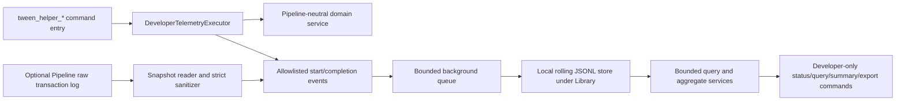

# TweenHelper Pipeline CLI Developer Telemetry Roadmap

- Status: Proposed developer-only extension to the Pipeline CLI roadmap
- Last reviewed: 2026-08-12
- Scope: Local observation of Pipeline tool-call attempts, TweenHelper command health, workflow diagnostics, safety evidence, bounded storage, and sanitized developer reports
- Parent roadmap: [TweenHelperPipelineCliRoadmap.md](TweenHelperPipelineCliRoadmap.md)

This roadmap adds local developer telemetry to the repository-only TweenHelper Pipeline tooling. It does not add customer analytics, remote reporting, or a dependency to the TweenHelper base artifact or future public Pipeline companion.

The goal is to answer practical development questions: which commands are called, which paths are slow or unreliable, where callers get stuck, whether retries are idempotent, and whether temporary resources are cleaned up. The telemetry must be useful without retaining prompts, source content, object names, paths, authentication data, or raw command payloads.

## Binding decisions

1. **Developer-only and off by default.** Telemetry lives under `Assets/_Project/TweenHelperDevelopment/CLI` and must require an explicit local opt-in. It is excluded from every customer artifact.
2. **Local-only.** No event, aggregate, or report is uploaded. Enabling telemetry must not create network traffic or register a remote analytics SDK.
3. **Metadata before payloads.** The normal recorder stores allowlisted metadata and typed outcome codes. It never stores raw request or response JSON.
4. **Define "every tool call" honestly.** The primary guarantee is every observable `tween_helper_*` command-handler attempt routed through the shared developer adapter executor. Optional Pipeline transaction import can broaden coverage to authenticated `/api/exec` calls, but it cannot observe other MCP servers, shell/browser calls, rejected authentication attempts, or arbitrary direct method calls.
5. **Two complementary sources, one event contract.** TweenHelper-owned handlers emit safe semantic events directly. Pipeline-wide HTTP coverage, if enabled separately, is imported from Pipeline's transaction log and reduced to the same sanitized schema.
6. **No vendor patching.** Do not modify or copy `com.unity.pipeline`, replace its live server, or depend on its internal `PipelineTransactionLog`. Re-evaluate only if a future pinned Pipeline version exposes a supported transaction observer.
7. **Telemetry cannot affect command results.** Recorder, queue, serialization, rotation, and report failures are contained and surfaced through telemetry health counters. They never convert a successful command into a failure or hide the command's original exception.
8. **First-party begin and completion are distinct.** Record a lightweight `call_started` event before TweenHelper handler execution and a correlated `call_completed` event in `finally`. A start without completion becomes evidence of interruption after reload, shutdown, or a process crash; it is not silently counted as success. A Pipeline-log import emits one `transaction_observed` event after the response and must not invent a start time or duration.
9. **Bound everything.** Event size, queue length, file size, file count, age, query page size, aggregation window, and export size all have hard limits. When the queue is full, drop telemetry and increment a visible counter instead of blocking Unity's main thread.
10. **Telemetry is evidence, not proof.** Aggregates guide investigation. Tests, structured command results, Unity Console checks, and source-state comparisons remain the authority for correctness and safety.

## Coverage contract

"Tool call" in this document means a Pipeline command execution attempt, normally sent to `/api/exec`. It does not mean every C# or DOTween method called inside a command.

| Invocation path | Planned source | Coverage claim | Known gap |
| --- | --- | --- | --- |
| `tween_helper_*` over Pipeline HTTP after input binding | Shared TweenHelper adapter executor | Required: start and completion for every registered TweenHelper handler | Malformed JSON, unknown commands, and binding failures occur before handler entry |
| Direct TweenHelper handler invocation in tests/tools | Shared TweenHelper adapter executor | Required when the invocation uses the same command entry point | A test that bypasses the adapter and calls a domain service is not a tool call |
| Any authenticated Pipeline `/api/exec` transaction | Optional sanitized import from `Logs/pipeline.log` | Best-effort post-response observation of built-in, TweenHelper, third-party, unknown-command, and binding-failure transactions | Available only while Pipeline raw transaction logging is explicitly enabled; no trustworthy start or duration |
| `/api/status`, `/api/commands`, and other non-exec endpoints | None | Excluded from tool-call metrics | These are transport/discovery requests, not command executions |
| Request rejected before `/api/exec` handling, including authentication/origin rejection | None | Excluded | Pipeline's transaction hook is invoked only by the exec response path |
| Calls made through another MCP server, shell, browser, or another Unity process | None | Unavailable | Outside the local Pipeline server boundary |
| Internal planning, resolver, catalog, sandbox, or verification stages | Explicit child spans emitted by TweenHelper services | Optional diagnostic timing beneath a recorded tool call | Spans are not counted as additional tool calls |

Every event must declare `source` and `coverage` so reports never merge first-party handler events and imported transport events as if they had identical semantics. When both sources expose the same safe correlation input, reports may link them through a per-session HMAC token. Without that token, keep the observations separate and aggregate one selected source; never deduplicate solely by command name and timing.

## Useful developer questions

The telemetry should support these concrete questions:

- Which commands are used most, and which commands are never reached in the intended context-to-verify workflow?
- What are the median, p95, and maximum TweenHelper handler latencies by command, outcome, cold/warm catalog state, and main-thread requirement?
- How much time is spent in TweenHelper-owned job queues and internal stages? Pipeline dispatcher/HTTP wait is unavailable in the pinned version and must remain explicitly unavailable rather than inferred.
- Which input schemas, target-reference forms, operation families, and option names most often lead to validation issues?
- Which typed issue codes, timeout categories, and cleanup failures recur?
- Are callers repeatedly retrying the same logical request, and do retries return an idempotent replay rather than duplicate work?
- Where do workflows stop: catalog, describe, target profile, plan, validation, preview, or verification?
- How often do catalog, configuration, plan, or target fingerprints become stale between phases?
- How many sandbox objects, tween handles, sessions, and jobs are created and cleaned up on success, failure, cancellation, timeout, reload, or expiry?
- Does telemetry itself drop events, exceed retention, add measurable main-thread cost, or fail to flush before reload?

## Explicitly not a use case

- Customer/product analytics, adoption tracking, marketing attribution, or cross-project user profiling.
- Capturing prompts, model output, chain-of-thought, source code, screenshots, scene contents, asset names, object names, or serialized property values.
- Tracking a developer with a persistent account, machine, device, or project identifier.
- Reconstructing an exact command for automatic replay. Reproduction uses an explicit safe fixture or a separately supplied command payload.
- Billing, token, or model-cost attribution. The installed Pipeline transport does not provide trustworthy model or token metadata.
- Replacing the Unity Profiler, Memory Profiler, tests, verification jobs, structured logs, or security auditing.
- Judging individual developer productivity from call counts or elapsed time.
- Automatically uploading a support bundle or attaching telemetry to an Asset Store submission.

## Event model

Use an append-only, versioned JSON Lines contract. A session manifest records stable environment metadata once; call events contain only the fields needed for a single attempt. Unknown additive fields are ignored by older readers, while a breaking semantic change increments `schemaVersion`.

### Priority 0: required on every call

| Field | Purpose and collection rule |
| --- | --- |
| `schemaVersion` | Event contract version. Start at `1`. |
| `eventType` | `call_started` or `call_completed` for first-party handlers; `transaction_observed` for Pipeline-log imports. Later span events use a different allowlisted type. |
| `eventId` / `callId` | Random opaque IDs. Start and completion share `callId`; neither is derived from project data. |
| `telemetrySessionId` / `sequence` | Random per-Editor-session ID plus a monotonic local sequence for ordering and gap detection. Never use a persistent machine ID. |
| `source` / `coverage` | For example `tween_helper_executor` + `handler`, or `pipeline_log_import` + `http_exec`. |
| `commandId` / `audience` | Stable command name and `developer`, `public_prototype`, `pipeline_builtin`, or `third_party`. Unknown commands are classified as `unknown`, not copied into an unrestricted label. |
| `observedAtUtc` / `startedAtUtc` | Every event has an observation timestamp. First-party completions may also carry the correlated handler start time. Imported entries use Pipeline's post-response log time and leave start unavailable. Duration never comes from wall-clock subtraction. |
| `durationMs` | End-to-end TweenHelper handler duration on first-party completion. Imported Pipeline entries leave it unavailable because the current transaction log has only a post-response timestamp. It excludes HTTP parsing, input binding, Pipeline dispatch wait, response serialization, and network time. |
| `mainThreadRequired` / `executionThread` | Declared dispatch requirement and observed `main` or `background` category. Do not store thread IDs. |
| `inputSchemaVersion` / `resultSchemaVersion` | Versions when safely available as bounded integers. Missing or unbindable input is reported as unknown. |
| `handlerOutcome` / `transportOutcome` / `domainStatus` | First-party handlers report `returned`, `threw`, or `interrupted`; imports report the outer response category; TweenHelper results report statuses such as `valid`, `invalid`, `rejected`, `failed`, `cancelled`, or `timed_out`. Unknown layers remain unavailable rather than being inferred. |
| `issueCodes` / `exceptionCategory` | Bounded allowlisted issue codes and normalized exception type/category. Never store exception messages, stack traces, or `errorDetails` in telemetry. |
| `requestBytes` / `responseBytes` | Serialized byte sizes, not content. The first-party handler source records only sizes it can measure honestly. |
| `redactionPolicyVersion` | Identifies the allowlist used to construct the event. |
| `telemetryHealth` | Whether this event was queued, whether fields were dropped by limits, and the recorder's cumulative dropped-event count. |

### Priority 1: semantic command dimensions

Add these only through command-specific allowlists:

- operation family and stable built-in operation ID;
- requested capability/mode, such as discovery, planning, sandbox preview, sandbox verification, developer audit, or authoring preflight;
- bounded Editor-state categories at handler entry: edit/play transition state, compiling/reloading flags, prefab-stage-open boolean, and relevant dirty-state boolean without scene/prefab names;
- target-reference kind (`global_id`, `guid_file_id`, `asset_path`, `instance_id`, or explicit `selection`) and target count, never the reference value;
- input field presence and option names, never arbitrary field values;
- pagination page size, filter presence, returned item count, cache hit/miss, and catalog build duration;
- `dryRun`, `confirm`, retry classification, and idempotency replay/conflict booleans;
- HMAC-based per-session correlation tokens for caller request IDs, plans, catalogs, target profiles, jobs, and preview sessions. Do not store the original IDs or stable hashes as telemetry identifiers;
- active session/job counts, queue depth, TTL-expiry category, cancellation source, and lifecycle transition;
- created, changed, destroyed, restored, rolled-back, and remaining-owned resource counts;
- before/after booleans for source fingerprint change, scene/prefab dirtiness change, selection change, asset/settings/manifest change, and cleanup success;
- warning/error counts and bounded observation counts without messages or values.

The MVP timing boundary begins at TweenHelper handler entry. Do not label it end-to-end tool latency. The current Pipeline package exposes neither request-arrival timing nor main-thread-dispatch wait to a project command.

### Priority 2: diagnostic child spans

Only add child spans after the core recorder is stable. Candidate spans are input mapping, object resolution, catalog query/build, target profiling, canonicalization, validation, TweenHelper-owned job queue wait, sandbox construction, tween construction, sampling, oracle evaluation, cleanup, result mapping, and report writing.

Each span uses an allowlisted name, parent `callId`, monotonic duration, outcome category, and bounded counters. Do not turn arbitrary method names or user strings into span names or labels.

### Session manifest

Record once per telemetry session:

- telemetry schema and recorder version;
- TweenHelper, developer adapter, Unity, Pipeline, DOTween, UI/TextMeshPro module, and test-framework versions when available;
- enabled capture modes and redaction policy version;
- random session ID, session start time, and previous-session interrupted-call count;
- retention limits and storage format version;
- capability flags for handler coverage, Pipeline-log import, spans, aggregation, export, and clear.

Do not record the project name/path, username, host name, IP address, operating-system account, Pipeline bearer token, branch name, remote URL, or a persistent installation ID.

### Example sanitized completion event

```json
{
  "schemaVersion": 1,
  "eventType": "call_completed",
  "eventId": "evt_opaque",
  "callId": "call_opaque",
  "telemetrySessionId": "session_opaque",
  "sequence": 42,
  "source": "tween_helper_executor",
  "coverage": "handler",
  "commandId": "tween_helper_validate_plan",
  "audience": "public_prototype",
  "observedAtUtc": "2026-08-12T12:00:00.005Z",
  "startedAtUtc": "2026-08-12T12:00:00.000Z",
  "durationMs": 4.6,
  "mainThreadRequired": true,
  "executionThread": "main",
  "inputSchemaVersion": 1,
  "resultSchemaVersion": 1,
  "handlerOutcome": "returned",
  "transportOutcome": "unavailable",
  "domainStatus": "invalid",
  "issueCodes": ["stale_target"],
  "requestBytes": 824,
  "responseBytes": 391,
  "dimensions": {
    "operationFamily": "preset",
    "targetReferenceKind": "global_id",
    "targetCount": 1,
    "retryKind": "first_attempt",
    "sourceFingerprintChanged": false,
    "cleanupStatus": "not_applicable"
  },
  "redactionPolicyVersion": 1
}
```

## Architecture



### First-party recorder

Add a Pipeline-neutral telemetry contract and sink interface in the repository-only automation core. The Pipeline adapter uses one shared `DeveloperTelemetryExecutor` around every `[CliCommand("tween_helper_...")]` handler. It creates the start event, starts a monotonic timer, maps only allowlisted semantic dimensions, and emits completion in `finally`.

The handler wrapper must preserve the original return value and exception. Telemetry exception handling is internal to the recorder. A reflection-based contract test discovers all registered `tween_helper_*` command methods and fails if one bypasses the shared executor.

Domain services may add child spans through a narrow context passed by the wrapper. They must not reference Pipeline DTOs or telemetry storage directly. When telemetry is disabled, the context is a no-op and does not serialize inputs, inspect extra Unity state, or open a file.

### Pipeline-wide HTTP import

The pinned `com.unity.pipeline` `0.3.1-exp.1` live Editor server has an opt-in `LogRequestsResponses` setting. When enabled, its `/api/exec` send path writes raw request and response JSON plus a post-response timestamp to `Logs/pipeline.log`. This is broader than TweenHelper handler instrumentation and includes unknown commands, conversion failures, and built-in/third-party commands.

Important constraints of the installed version:

- the transaction hook is protected and the concrete live server writes through an internal logger; there is no supported public observer event;
- the log contains raw payloads and may therefore contain paths, source content, object references, error details, or other sensitive values;
- it captures authenticated `/api/exec` responses, not discovery/status endpoints or requests rejected before routing;
- the entry time is recorded after the response and cannot provide trustworthy command duration;
- the log is a JSON array that is read and rewritten when an entry is appended, so it is not a tail-friendly or high-volume telemetry store;
- it rotates `pipeline.log` to `pipeline_old.log` once per Unity session.

For those reasons, Pipeline-wide import is a separate high-friction opt-in mode, not the default telemetry path. The importer reads a stable snapshot with bounded retries, parses only known structural fields, converts them immediately to allowlisted metadata, and never copies a raw token into the telemetry store. It reports source offsets/fingerprints through per-session HMACs so repeat imports can be deduplicated without retaining raw payload hashes.

Do not enable Pipeline raw transaction logging automatically. Do not delete or truncate Pipeline-owned logs automatically after import. The status UI/command must warn that the source log itself remains raw and tell the developer how to disable and remove it explicitly.

If a later pinned Pipeline release adds a supported redacted transaction observer, prefer that API and retire raw-log import behind a migration gate.

## Local storage, retention, and failure behavior

- Store sanitized active events under `Library/TweenHelper/Telemetry/v1/`. `Library` is project-local and ignored by this repository. Do not place telemetry under `Assets`, the base distribution root, `Packages`, or source-controlled documentation folders.
- Write append-only JSON Lines so a truncated final record can be ignored without losing the preceding session.
- Keep exported developer reports under `Temp/TweenHelper/Telemetry/` by default. Reports are also local and ignored.
- Proposed initial limits are 16 KiB per event, 2,048 queued events, 5 MiB per file, 25 MiB total, 10 session files, and 14 days of retention. Freeze final values in Phase T0 after measuring realistic command volumes.
- Rotate by size/session and prune oldest files only inside the resolved telemetry root. Validate the absolute resolved target before deletion.
- Use a bounded background writer. The main thread may enqueue a compact event but must not serialize raw command payloads or perform normal disk I/O.
- Flush best-effort on assembly reload and Editor shutdown within a short fixed budget. On the next session, classify unmatched starts as `interrupted`.
- If storage is unavailable, the command continues. `telemetry_status` reports last write error category, dropped events, queue high-water mark, corrupt/truncated records, and last successful flush without exposing paths or exception text.

## Developer command surface

These commands remain repository-only and are themselves recorded when telemetry is enabled. A query does not include its own completion event until the next query, which avoids recursive self-enumeration.

| Command | Side effects | Purpose |
| --- | --- | --- |
| `tween_helper_dev_telemetry_status` | Read-only | Report enabled modes, exact coverage claims, recorder/store versions, retention, queue/drop/write health, source-log risk warning, and available time range. |
| `tween_helper_dev_telemetry_query` | Read-only | Return a cursor-based bounded page of sanitized events filtered by session, time, command allowlist, source, outcome, domain status, or issue code. Default 25, hard maximum 100. |
| `tween_helper_dev_telemetry_summary` | Read-only | Return aggregate counts, latency percentiles, error/issue distributions, transition funnels, retry/idempotency rates, and cleanup outcomes for a bounded window. Enforce minimum sample counts before presenting percentiles/rates as meaningful. |
| `tween_helper_dev_telemetry_export` | Writes under `Temp/TweenHelper/Telemetry` | Export sanitized aggregates by default. Event-level export requires an explicit flag and reports the redaction policy, coverage, limits, and event count. Never export Pipeline raw logs. |
| `tween_helper_dev_telemetry_clear` | Deletes only the resolved telemetry store | Dry-run reports exact session/file counts and store generation. Confirm requires the matching generation and explicit scope; it never deletes Pipeline-owned raw logs. |

Enable/disable controls should use a developer menu or developer-only command backed by project-local ignored configuration under `Library`. Enabling `tween_helper_only` and enabling `pipeline_http_import` are separate decisions. A domain reload or server restart must not silently broaden the selected mode.

## Recommended summaries

### Command health

For each command and source, report call count, completed/interrupted count, success/domain-failure/transport-failure/cancel/timeout counts, p50/p95/max duration, request/response size percentiles, and telemetry completeness. Do not emit p95 when the sample count is too small; show the count instead.

### Workflow funnel

Within an ephemeral correlation window, summarize transitions such as `context -> catalog -> describe -> target_profile -> plan -> validate -> preview -> verify`. Report retries, backtracks, abandoned preview sessions, and the issue code at the last observed step. Do not infer user intent or developer quality.

### Schema and compatibility friction

Group failures by input/result schema version, target-reference kind, operation family, capability, unknown-field presence, unsupported option name, compatibility tuple, and typed issue code. Never group by raw path, object name, arbitrary error message, or caller-provided string.

### Safety and cleanup

Summarize source-state-change booleans, created/destroyed/restored/remaining owned-resource counts, idempotency replays/conflicts, rollback outcomes, session/job expiries, cleanup failures, and interruption recovery. Any source-state mutation from a read-only/sandbox command is a high-severity investigation signal, not merely a chart point.

## Privacy and redaction policy

Use an allowlist serializer that constructs a new telemetry object. Do not serialize a DTO and then try to remove known secrets. New command fields are therefore excluded until explicitly reviewed.

Never retain:

- Pipeline bearer tokens, headers, ports combined with tokens, or instance descriptor contents;
- raw requests, responses, prompts, error details, exception messages, stack traces, Console messages, or log text;
- project/user/machine names, absolute paths, asset paths, GUIDs, file IDs, GlobalObjectIds, instance IDs, hierarchy paths, object names, scene names, or selection names;
- source code, file contents, serialized values, animation values, vector/color values, screenshots, or report contents;
- full caller request IDs, plan/catalog/configuration/target hashes, job IDs, session IDs, preflight tokens, or idempotency keys;
- arbitrary command names, parameter names, issue codes, operation IDs, or span names that do not pass a bounded allowlist/registry classification.

When correlation is needed, use HMAC-SHA-256 with a random in-memory per-telemetry-session key and store only a short encoded correlation token. Do not persist the key. This permits correlation within one developer session without creating a stable cross-session project fingerprint. Do not hash a secret or path with plain SHA-256 and call it anonymized.

## Test and evidence matrix

| Area | Required evidence |
| --- | --- |
| Registration coverage | Reflection/discovery test proves every registered `tween_helper_*` command routes through the shared executor; an intentional bypass fixture fails the guard. |
| Outcomes | Success, expected domain invalid/rejected/failed, binding failure, unexpected exception, cancellation, timeout, retry, idempotent replay/conflict, and interrupted start are classified correctly. |
| Timing | Monotonic handler duration, TweenHelper-owned job-queue wait, async completion, and unavailable Pipeline dispatch/imported duration are not conflated. |
| Redaction | Fixtures containing tokens, absolute/asset paths, GUID/file IDs, object names, source text, error details, stacks, and unknown fields produce no forbidden text or stable plain hashes in events/exports. |
| Disabled path | No files, serialization, extra Unity object inspection, or network traffic; measured overhead is documented and within the Phase T0 budget. |
| Enabled performance | Queue enqueue and child-span overhead are measured on main/background threads; normal file writes remain off the main thread; queue saturation drops telemetry rather than commands. |
| Storage | Rotation, retention, exact-root confinement, truncated final line, corrupt record, concurrent read/write snapshot, disk-full/access-denied behavior, and store-generation clear gate. |
| Reload/lifecycle | Best-effort flush on reload/shutdown, unmatched-start interruption classification, new random session identity, and no live Unity object retained across reload. |
| Query/summary | Cursor stability, hard page/window limits, filter allowlists, small-sample percentile behavior, source separation, and self-observation semantics. |
| Pipeline import | Explicit opt-in warning, authenticated exec success/failure/unknown command, deduplication with handler events, raw-token rejection, rotation handling, malformed/raw-log race, and honest gap reporting. |
| Safety dimensions | Declared side-effect class matches command metadata; owned resource counts and before/after state flags are populated only by the responsible service. |
| Packaging | Base export and public companion contain no telemetry assembly, settings, events, reports, menus, commands, or Pipeline raw logs. |
| Network/privacy | No analytics SDK or external endpoint; telemetry enable/query/export/clear can be exercised with network disabled. |

## Phased roadmap

### Phase T0 - Contract, feasibility, and privacy gate

- [ ] Freeze the definition of a tool call, source/coverage taxonomy, event lifecycle, versioning, outcome taxonomy, and source-deduplication rules.
- [ ] Pin and document the exact Pipeline `0.3.1-exp.1` transaction behavior: opt-in flag, `/api/exec` coverage, raw payload risk, post-response timestamp, rotation, and lack of a public observer.
- [ ] Freeze the Priority 0 event schema, command/issue/operation allowlists, per-session HMAC correlation policy, and forbidden-field test corpus.
- [ ] Choose the ignored local configuration mechanism and prove telemetry is disabled by default in a clean project.
- [ ] Measure representative command volume and set event, queue, disk, age, query, export, flush, and overhead budgets.
- [ ] Define the public-artifact exclusion check and update the main CLI threat/privacy contract.

Exit criteria: another agent can state exactly which calls are visible, which are not, what is stored, where it is stored, how it is bounded, and why no retained field exposes project content or a persistent identity.

### Phase T1 - TweenHelper handler recorder MVP

- [ ] Add repository-only event models, clock/ID abstractions, no-op and bounded sinks, JSONL writer, retention service, and health snapshot.
- [ ] Add the shared adapter executor and route every current `tween_helper_*` command through it without changing command schemas or results.
- [ ] Emit paired start/completion events for success, domain outcomes, and exceptions; reconcile unmatched starts after reload.
- [ ] Add Priority 0 metadata only, plus command-specific allowlisted schema/status dimensions already present in structured inputs/results.
- [ ] Add `tween_helper_dev_telemetry_status` and a developer-local enable/disable control for `tween_helper_only` mode.
- [ ] Prove disabled mode performs no serialization/file operations and recorder failures never affect command outcomes.

Exit criteria: every registered TweenHelper handler attempt produces bounded, sanitized paired evidence when explicitly enabled, and produces no telemetry artifact when disabled.

### Phase T2 - Bounded queries and aggregates

- [ ] Implement robust session/JSONL readers that tolerate truncation and skip corrupt records with counted diagnostics.
- [ ] Add cursor-based query and bounded summary commands with strict enum/allowlist filters.
- [ ] Implement command-health, issue, latency, retry/idempotency, workflow-transition, and telemetry-completeness aggregates.
- [ ] Add minimum sample thresholds and preserve source/coverage distinctions in every aggregate.
- [ ] Add sanitized aggregate export under `Temp` and generation-gated store clearing.
- [ ] Verify telemetry commands record themselves without recursion or unbounded output.

Exit criteria: a maintainer can identify slow/failing commands and workflow drop-off from bounded local summaries without opening an event file or seeing raw project values.

### Phase T3 - Optional Pipeline-wide HTTP import

- [ ] Add a separate `pipeline_http_import` opt-in with an explicit warning that Pipeline's source log stores raw request/response data.
- [ ] Read `pipeline.log`/`pipeline_old.log` through a bounded stable-snapshot strategy without referencing Pipeline internals or changing its files.
- [ ] Parse only the installed version's known transaction structure, classify command IDs through the discovered registry, and sanitize into the common event model in memory.
- [ ] Link imported TweenHelper transactions to first-party handler events only when a safe request-correlation token exists. Otherwise keep them separate and make summaries choose one source rather than using time-based heuristic deduplication.
- [ ] Report unavailable duration, skipped/unknown entries, rotation gaps, parse races, import lag, and requests outside the observable boundary.
- [ ] Add a compatibility gate that disables import with an actionable status when a future Pipeline log contract is unknown.

Exit criteria: while separately enabled, authenticated Pipeline HTTP tool calls are represented as sanitized metadata with explicit gaps, and no raw token from the Pipeline log is copied into telemetry events or exports.

### Phase T4 - Planning, preview, and job semantics

- [ ] Add allowlisted dimensions and spans for catalog cache/build, target-reference kind, planning/canonicalization/validation, and typed stale reasons.
- [ ] Correlate plan-to-preview-to-verification flow with per-session HMAC tokens rather than stable raw hashes/IDs.
- [ ] Add preview/job lifecycle transitions, concurrency/queue depth, TTL/cancel/timeout/interruption categories, and owned-resource cleanup counts.
- [ ] Record state-change safety booleans from existing comparison services; do not perform new broad Unity/project scans solely for telemetry.
- [ ] Add verification scenario/oracle categories and observation counts without values or log messages.
- [ ] Add authoring preflight/idempotency/rollback dimensions only after the main roadmap enables persisted authoring.

Exit criteria: the telemetry explains where a supported workflow spent time and stopped, and highlights cleanup/safety anomalies without retaining the plan, target identity, or observed animation values.

### Phase T5 - Hardening and artifact exclusion

- [ ] Exercise queue saturation, high-volume calls, disk failure, corrupt/truncated data, domain reload, Editor shutdown, Pipeline log rotation, and telemetry-version migration.
- [ ] Measure disabled/enabled overhead and tune budgets without weakening drop/retention visibility.
- [ ] Prove no external traffic and no telemetry code/data/settings in the base package or future public companion.
- [ ] Document enablement, exact coverage, raw Pipeline log risk, queries, exports, clearing, retention, and troubleshooting for maintainers.
- [ ] Re-review every event dimension when a command schema, Pipeline version, or public/private boundary changes.

Exit criteria: telemetry remains local, bounded, resilient, truthfully scoped, and absent from customer artifacts under failure, reload, upgrade, and packaging paths.

## Integration with the main CLI phases

| Main CLI phase | Telemetry work admitted |
| --- | --- |
| Phase 0 - contract proof | Complete T0 decisions; telemetry must not block command-schema proof. |
| Phase 1 - developer discovery | Implement T1 around the shared adapter executor after command entries exist. Record catalog cache/build only after measurement fields are reviewed. |
| Phase 2 - planner/validator | Add plan/validation status, stale-reason, schema, and per-session correlation dimensions from T4. |
| Phase 3 - preview | Add session lifecycle, sampling category, owned-resource, timeout, and cleanup dimensions from T4. |
| Phase 4 - verification/jobs | Add job lifecycle, queue, cancellation, scenario, oracle, report, and cleanup dimensions; finish T2 summaries. |
| Phase 5 - public companion | Run T5 exclusion proof. Do not extract telemetry into the companion. |
| Phase 6 - authoring | Add only preflight/idempotency/rollback metadata after a separate privacy review; never store targets, paths, tokens, or change values. |

Telemetry failures never block a main CLI phase. A missing safety signal can block a claim made by a telemetry report, but the authoritative command tests and state evidence remain separate.

## Immediate next implementation slice

The first telemetry implementation request should cover only T0 and T1 after the current Phase 1 command entries share a stable execution path:

1. Re-read this roadmap and the parent CLI roadmap.
2. Inspect the exact installed Pipeline source again; experimental package behavior may change.
3. Freeze the event/forbidden-field schemas and storage/overhead budgets before writing the recorder.
4. Implement only `tween_helper_only` handler coverage, the disabled/no-op path, bounded local storage, paired events, interruption recovery, and telemetry status.
5. Add the registration-coverage and redaction tests before adding queries, aggregates, spans, or raw Pipeline import.
6. Do not enable Pipeline raw request/response logging, implement remote upload, or add public/customer telemetry in the MVP.
7. Preserve unrelated active CLI implementation changes and capture fresh Unity Console evidence after C# compilation.

## References

Project references:

- [TweenHelperPipelineCliRoadmap.md](TweenHelperPipelineCliRoadmap.md)
- `Assets/_Project/TweenHelperDevelopment/CLI`
- `Assets/_Project/TweenHelperDevelopment/Validation`
- `Assets/_Project/TweenHelperDevelopment/Tests`
- root `ROADMAP.md`

Pinned Pipeline `0.3.1-exp.1` references:

- installed `Library/PackageCache/com.unity.pipeline@*/package.json`
- installed `Library/PackageCache/com.unity.pipeline@*/Runtime/Common/BasePipelineServer.cs`
- installed `Library/PackageCache/com.unity.pipeline@*/Runtime/Models/CommandExecutionRequest.cs`
- installed `Library/PackageCache/com.unity.pipeline@*/Runtime/Models/CommandExecutionResponse.cs`
- installed `Library/PackageCache/com.unity.pipeline@*/Editor/EditorPipelineServer.cs`
- installed `Library/PackageCache/com.unity.pipeline@*/Editor/EditorPipelineStartup.cs`
- installed `Library/PackageCache/com.unity.pipeline@*/Editor/EditorPipelineManager.cs`
- installed `Library/PackageCache/com.unity.pipeline@*/Editor/PipelineTransactionLog.cs`
- installed `Library/PackageCache/com.unity.pipeline@*/Documentation~/creating-commands.md`
- installed `Library/PackageCache/com.unity.pipeline@*/Documentation~/safety-and-mutations.md`
- installed `Library/PackageCache/com.unity.pipeline@*/Documentation~/testing.md`
